<div align="center">


# SSam B Guard

**초저비용 고효율 서버 모니터링 및 알림 통합 솔루션**

AWS Lambda와 Turso(LibSQL) 기반으로 구축된 오픈소스 모니터링 시스템으로, 월 $0.1 미만의 비용으로 24시간 서버 로그와 시스템 지표를 관리합니다.

|                                                                           프론트엔드                                                                            |                                                                            백엔드                                                                             |                                                              배포 링크                                                               |
| :-------------------------------------------------------------------------------------------------------------------------------------------------------------: | :-----------------------------------------------------------------------------------------------------------------------------------------------------------: | :----------------------------------------------------------------------------------------------------------------------------------: |
| [](https://github.com/EduOps-Lab/ssambee-fe) | [](https://github.com/EduOps-Lab/ssambee-be) | [](https://www.ssambee.com) |

</div>

## 📋 목차

- [SSam B Guard](#ssam-b-guard)
  - [📋 목차](#-목차)
  - [✨ 핵심 역할](#-핵심-역할)
  - [🛠 기술 스택](#-기술-스택)
  - [📁 프로젝트 구조](#-프로젝트-구조)
    - [폴더 구조](#폴더-구조)
    - [시스템 아키텍처](#시스템-아키텍처)
  - [💡 트러블슈팅: AWS Lambda 환경의 실시간 SSE 스트리밍 지연 문제 해결](#-트러블슈팅-aws-lambda-환경의-실시간-sse-스트리밍-지연-문제-해결)
  - [🚀 실행 및 배포](#-실행-및-배포)
    - [로컬 개발 및 실행](#로컬-개발-및-실행)
    - [빌드 및 배포](#빌드-및-배포)
  - [🛸 팀 소개](#-팀-소개)

---

## ✨ 핵심 역할

- **실시간 모니터링**: AWS Lambda Function URL Response Streaming을 활용한 실시간 로그 및 지표 시각화 대시보드 제공
- **초저비용 운영**: AWS Lambda와 Turso(LibSQL)의 프리티어를 극대화하여 월 $0.1 미만의 비용으로 운영 가능한 구조 설계
- **다양한 알림 통합**: 장애 및 임계치 도달 시 Discord 웹훅 및 카카오 알림톡(Solapi)을 통한 즉각적인 상황 전파
- **로그 분석 및 관리**: 서버 사이드 페이지네이션과 필터링 기능을 통해 대량의 로그 중 필요한 정보를 빠르게 조회
- **리소스 최적화**: 14일 경과 로그 자동 삭제 및 관리자 승인 기반 유저 가입 시스템 등 효율적인 리소스 관리 지원

---

## 🛠 기술 스택

| 분류         | 스택                                                                                                                                                                                                                                                                                                                                                                                                                                                                                                                                                                                                                                                                                                                                                                                   |
| ------------ | -------------------------------------------------------------------------------------------------------------------------------------------------------------------------------------------------------------------------------------------------------------------------------------------------------------------------------------------------------------------------------------------------------------------------------------------------------------------------------------------------------------------------------------------------------------------------------------------------------------------------------------------------------------------------------------------------------------------------------------------------------------------------------------- |
| **Backend**  |                                                                                                                                                                            |
| **Database** |                                                                                                                                                                                                                                                                                                                                                                                                                                                                     |
| **Infra**    |                                                                                                                                                                                                                                          |
| **Analytics**|                                                                                                                                                                                                                                                                                                                                                                                                                                                                                                                                       |

---

## 📁 프로젝트 구조

AWS Lambda 기반의 서버리스 아키텍처를 채택하여, 각 기능별로 독립적인 람다 함수가 동작하도록 구성되었습니다.

### 폴더 구조

```text
frontend/           # 💻 Next.js 15 (React 19) 기반 관리 대시보드
functions/          # 🚀 AWS Lambda 소스 코드
├── central-monitor # 시스템 지표 감시 및 장애 전파 (Discord/SQS)
├── kakao-notification # SQS 트리거 기반 카카오 알림톡 발송 (Solapi)
├── monitoring-dashboard # 대시보드 API 및 SSE 스트리밍 서비스
└── log-cleanup     # 14일 경과 로그 자동 삭제 배치 작업
terraform/          # 🏗️ IaC를 통한 AWS 인프라 자동화 정의
```

### 시스템 아키텍처

```mermaid
flowchart LR
  subgraph DataIn["데이터 수집"]
    AppServers["백엔드 서버들"] -- "Log Ingest" --> IngestLambda["Ingest Lambda"]
  end

  subgraph Processing["모니터링 및 처리"]
    IngestLambda --> Turso[(Turso DB)]
    CentralMonitor["Central Monitor"] -- "지표 검사" --> Turso
    LogCleanup["Log Cleanup"] -- "배치 작업" --> Turso
  end

  subgraph Notification["알림 및 전파"]
    CentralMonitor -- "임계치 초과" --> Discord[Discord Webhook]
    CentralMonitor -- "알림 요청" --> SQS[AWS SQS]
    SQS --> KakaoLambda[Kakao Lambda]
    KakaoLambda --> Solapi[Solapi API]
  end

  subgraph Presentation["대시보드"]
    DashboardAPI["Dashboard API"] -- "SSE Stream" --> Frontend[Next.js Dashboard]
    DashboardAPI -- "쿼리" --> Turso
  end
```



---

## 💡 트러블슈팅: AWS Lambda 환경의 실시간 SSE 스트리밍 지연 문제 해결

**문제(증상):**
대시보드에서 실시간 로그 피드를 구현하기 위해 SSE(Server-Sent Events)를 도입했으나, AWS Lambda의 기본 응답 구조상 전체 데이터가 버퍼링된 후 한 번에 반환되는 문제가 발생했습니다. 이로 인해 실시간 로그가 수 초간 지연된 후 뭉쳐서 나타나거나, 긴 연결 유지 시 타임아웃이 발생하는 증상이 있었습니다.

**원인:**
표준 AWS Lambda 응답 모델은 '요청-응답' 기반으로 설계되어 있어, 응답 본문 작성이 완료될 때까지 클라이언트로 데이터를 전송하지 않습니다. 따라서 스트리밍 방식인 SSE의 실시간성을 보장할 수 없었습니다.

**해결방법:**
AWS Lambda의 신기능인 `awslambda.streamifyResponse`와 **Lambda Function URL**의 스트리밍 응답 설정을 활용했습니다. 이를 통해 로그 데이터가 발생하는 즉시 클라이언트로 스트리밍할 수 있도록 아키텍처를 개선했습니다. 결과적으로 대시보드에서는 로그 발생 1초 이내에 실시간으로 메시지를 확인할 수 있게 되었으며, 연결 안정성 또한 대폭 향상되었습니다.

---

## 🚀 실행 및 배포

### 로컬 개발 및 실행

```bash
# 의존성 설치
$ pnpm install

# 대시보드 로컬 실행
$ cd frontend && pnpm run dev

# 테스트 실행
$ pnpm test
```

### 빌드 및 배포

```bash
# 모든 Lambda 함수 빌드 (esbuild 번들링)
$ pnpm run build

# 테라폼을 통한 인프라 배포
$ cd terraform
$ terraform init
$ terraform apply
```

---

## 🛸 팀 소개

|                   👑 박창기                    |                    이유리                    |                          임경민                           |                     김윤기                      |
| :--------------------------------------------: | :------------------------------------------: | :-------------------------------------------------------: | :---------------------------------------------: |
|  |  |  |  |
|                  PM & 프론트                   |                    프론트                    |                          백엔드                           |                  백엔드 & 배포                  |

## 🤝 Contributing

Thank you for your interest in `ssambee-guard`! Contributions are always welcome.

- If you find a bug or have a suggestion, please create an **Issue**.
- To contribute code, please **Fork** the repository and send a **Pull Request** from a **Feature Branch**.
- We recommend starting with issues labeled **Good First Issue**.

"Your small contribution can save someone's monthly server costs."

---

## 🔗 Links

- **Issue Tracker**: [GitHub Issues](https://github.com/your-repo/ssambee-guard/issues)
- **Related Projects**:
  - [Solapi SDK](https://github.com/solapi/solapi-nodejs)
  - [Turso (LibSQL)](https://turso.tech)

---
---

<div align="center">

**Made with ❤️ by SSam B Team**

</div>
